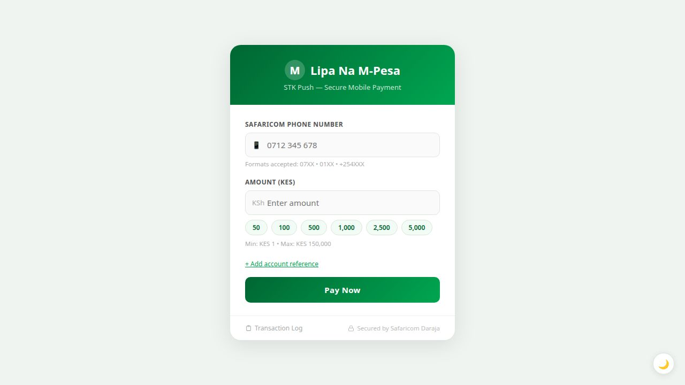
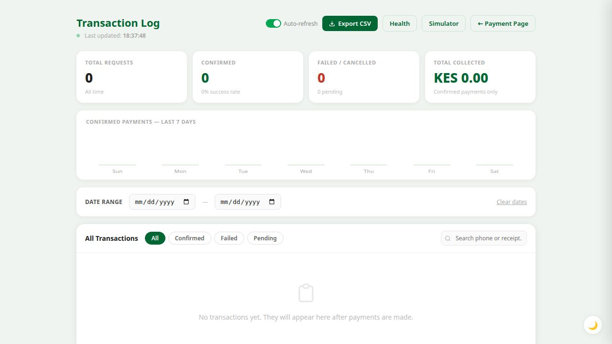
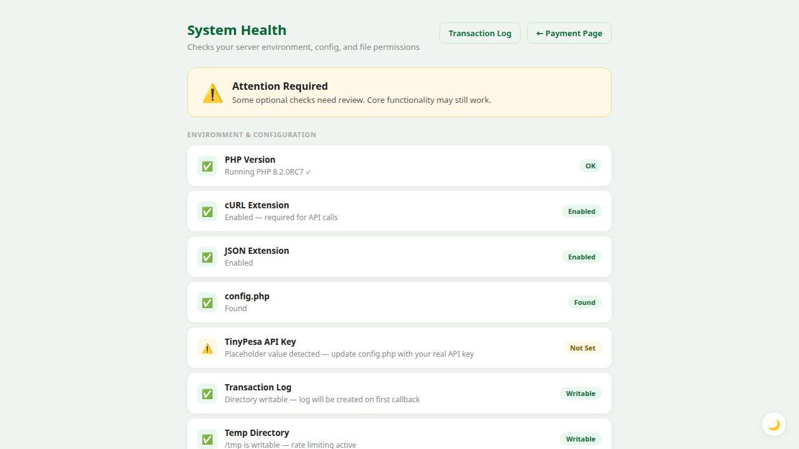
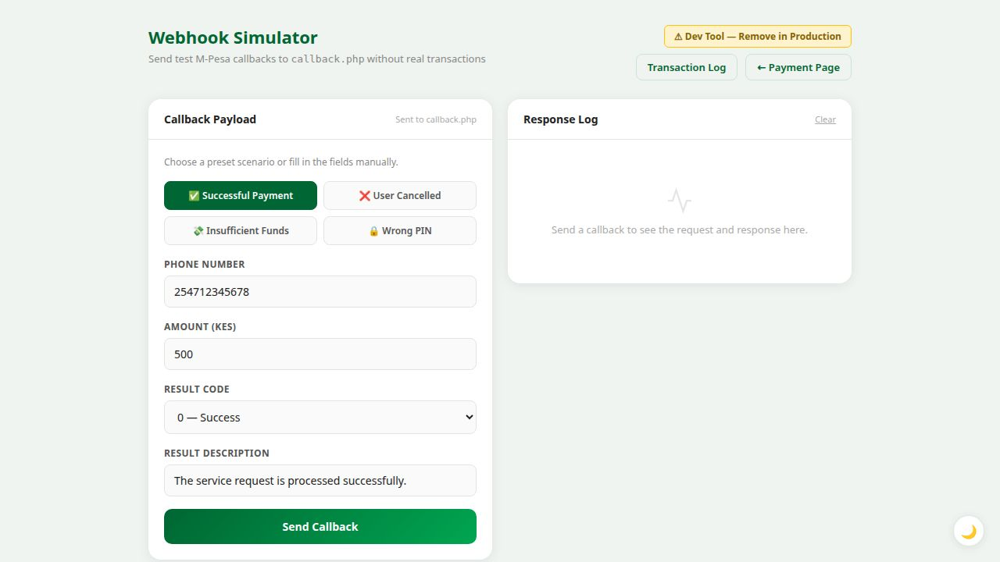

# M-Pesa STK Push — PHP Integration

A clean, production-ready PHP integration for **Lipa Na M-Pesa Online** (STK Push) using the [TinyPesa](https://tinypesa.com) API. No complex OAuth flows — just an API key and you're ready to accept M-Pesa payments.

No frameworks. No build tools. Plain PHP + vanilla JS.

---

## Screenshots

<table>
  <tr>
    <td align="center"><strong>Payment Form</strong></td>
    <td align="center"><strong>Admin Panel</strong></td>
  </tr>
  <tr>
    <td></td>
    <td></td>
  </tr>
  <tr>
    <td align="center"><strong>System Health Check</strong></td>
    <td align="center"><strong>Webhook Simulator</strong></td>
  </tr>
  <tr>
    <td></td>
    <td></td>
  </tr>
</table>

---

## Supported Payment Providers

Switch providers by changing one constant in `config.php` — no other code changes needed.

| Provider | Countries | Flow | Required credentials |
|---|---|---|---|
| **TinyPesa** (default) | Kenya | STK Push | `TINYPESA_API_KEY` |
| **Safaricom Daraja** | Kenya | STK Push | `DARAJA_CONSUMER_KEY`, `DARAJA_CONSUMER_SECRET`, `DARAJA_SHORTCODE`, `DARAJA_PASSKEY` |
| **PesaPal V3** | Kenya, Uganda, Tanzania, Rwanda + more | Hosted checkout | `PESAPAL_CONSUMER_KEY`, `PESAPAL_CONSUMER_SECRET`, `PESAPAL_IPN_URL` |
| **Flutterwave** | 30+ African countries | Hosted checkout | `FLW_SECRET_KEY`, `FLW_PUBLIC_KEY`, `FLW_REDIRECT_URL` |
| **Paystack** | Nigeria, Ghana, Kenya, South Africa, Egypt + more | Hosted checkout | `PAYSTACK_SECRET_KEY`, `PAYSTACK_CALLBACK_URL` |
| **MTN MoMo** | Ghana, Uganda, Côte d'Ivoire, Cameroon, Zambia, Rwanda + more | STK-style push | `MTNMOMO_SUBSCRIPTION_KEY`, `MTNMOMO_API_USER`, `MTNMOMO_API_KEY` |
| **Airtel Money** | Kenya, Uganda, Tanzania, Rwanda, Zambia, DRC + more | STK-style push | `AIRTEL_CLIENT_ID`, `AIRTEL_CLIENT_SECRET` |
| **DPO Pay** | 20+ African countries | Hosted checkout | `DPO_COMPANY_TOKEN`, `DPO_SERVICE_TYPE`, `DPO_REDIRECT_URL` |
| **Ozow** | South Africa | Instant EFT | `OZOW_SITE_CODE`, `OZOW_PRIVATE_KEY`, `OZOW_API_KEY` |
| **CinetPay** | Côte d'Ivoire, Senegal, Cameroon, Mali, Burkina Faso, Togo, Guinea + 8 more | Hosted checkout | `CINETPAY_API_KEY`, `CINETPAY_SITE_ID`, `CINETPAY_NOTIFY_URL` |
| **Paymob** | Egypt, Morocco, Pakistan, UAE, Saudi Arabia, Oman, Kuwait | Hosted checkout | `PAYMOB_API_KEY`, `PAYMOB_INTEGRATION_ID`, `PAYMOB_IFRAME_ID` |
| **Ecocash** | Zimbabwe, Eswatini, Lesotho | STK Push | `ECOCASH_MERCHANT_CODE`, `ECOCASH_MERCHANT_PIN`, `ECOCASH_MERCHANT_NUMBER` |
| **Orange Money** | Côte d'Ivoire, Senegal, Mali, Burkina Faso, Guinea, Cameroon, Morocco, Tunisia + more | Hosted checkout | `ORANGE_CLIENT_ID`, `ORANGE_CLIENT_SECRET`, `ORANGE_MERCHANT_KEY` |
| **Cellulant Tingg** | Kenya, Uganda, Tanzania, Rwanda, Nigeria, Ghana, Zambia, Zimbabwe, Mozambique, Ethiopia + 8 more | Hosted checkout | `CELLULANT_API_KEY`, `CELLULANT_CLIENT_ID`, `CELLULANT_SERVICE_CODE` |
| **EVC Plus** | Somalia (Hormuud Telesom — Mogadishu & south); compatible with Telesom Zaad (Somaliland) | STK Push | `EVCPLUS_MERCHANT_UID`, `EVCPLUS_API_USER_ID`, `EVCPLUS_API_KEY` |
| **Wave** | Senegal, Côte d'Ivoire, Mali, Burkina Faso, Cameroon, Uganda, Zambia | Hosted checkout | `WAVE_API_KEY`, `WAVE_SUCCESS_URL`, `WAVE_ERROR_URL`, `WAVE_CALLBACK_URL` |
| **Telebirr** | Ethiopia — Ethiotelecom, 40M+ users | Hosted checkout | `TELEBIRR_APP_ID`, `TELEBIRR_APP_KEY`, `TELEBIRR_SHORT_CODE`, `TELEBIRR_PUBLIC_KEY` |
| **Moov Africa / Flooz** | Togo, Bénin, Niger, Burkina Faso, Côte d'Ivoire, Chad, Gabon, DR Congo, Madagascar | STK Push | `MOOV_API_KEY`, `MOOV_API_SECRET`, `MOOV_CALLBACK_URL` |

**STK / STK-style push** providers send a payment prompt directly to the customer's phone — no browser redirect needed.  
**Hosted checkout** providers redirect the customer to a payment page in their browser.

```php
// config.php — choose one
define('PAYMENT_PROVIDER', 'tinypesa');     // default — M-Pesa Kenya
define('PAYMENT_PROVIDER', 'daraja');       // Safaricom direct — M-Pesa Kenya
define('PAYMENT_PROVIDER', 'pesapal');      // East Africa hosted checkout
define('PAYMENT_PROVIDER', 'flutterwave'); // Pan-African hosted checkout
define('PAYMENT_PROVIDER', 'paystack');    // West + East + South Africa
define('PAYMENT_PROVIDER', 'mtnmomo');     // MTN Mobile Money push
define('PAYMENT_PROVIDER', 'airtelmoney'); // Airtel Money push
define('PAYMENT_PROVIDER', 'dpopay');      // DPO Pay — 20+ African countries
define('PAYMENT_PROVIDER', 'ozow');        // South Africa instant EFT
define('PAYMENT_PROVIDER', 'cinetpay');   // Francophone West/Central Africa (15+ countries)
define('PAYMENT_PROVIDER', 'paymob');     // Egypt, Morocco, North Africa
define('PAYMENT_PROVIDER', 'ecocash');    // Zimbabwe STK push
define('PAYMENT_PROVIDER', 'orangemoney'); // West & North Africa (13+ countries)
define('PAYMENT_PROVIDER', 'cellulant');  // Pan-African Tingg checkout (18+ countries)
define('PAYMENT_PROVIDER', 'evcplus');    // Somalia — Hormuud EVC Plus STK push
define('PAYMENT_PROVIDER', 'wave');       // Wave — West Africa (SN/CI/ML/BF/CM/UG/ZM)
define('PAYMENT_PROVIDER', 'telebirr');  // Ethiopia — Ethiotelecom Telebirr
define('PAYMENT_PROVIDER', 'moovafrica'); // Moov Africa / Flooz — 9 countries
```

---

## Features

**Payment flow**
- STK Push (TinyPesa / Daraja) — sends a PIN prompt directly to the customer's phone
- Hosted checkout (PesaPal / Flutterwave) — redirects to provider's payment page
- Real-time inline phone and amount validation before submission
- Quick-amount chips (50, 100, 500, 1,000, 2,500, 5,000) on the payment form
- Optional account reference field (shown/hidden on demand)
- Payment status polling — auto-detects confirmation and shows a receipt (STK Push providers)
- Rate limiting — max 5 payment requests per IP per minute (file-based, no Redis required)

**Admin panel**
- Summary stats: total requests, confirmed, failed, total KES collected
- 7-day confirmed payments bar chart (pure SVG, computed in PHP — no JS charting library)
- Date range filter — filter the transaction table by from/to date
- Status tabs — All / Confirmed / Failed / Pending
- Full-text search by phone number, receipt, or provider name
- Provider badge column — shows which gateway processed each transaction, sortable
- Click any row to open a slide-out detail drawer with the full transaction record
- Pagination — 20 rows per page, works in combination with all filters
- CSV export — downloads all transactions with Provider column; respects the active date range filter

**Developer tools**
- `/health.php` — shows active provider name + flow type, checks all required credentials for that provider, PHP version, cURL, JSON, log writability, temp dir, and HTTPS
- `/webhook_test.php` — sends simulated M-Pesa callbacks to `callback.php` with four preset scenarios (success, user cancelled, insufficient funds, wrong PIN)

**Production hardening**
- `.htaccess` — blocks direct browser access to `config.php`, `mpesa_log.json`, and all `.json` files; disables directory listings; adds security headers; routes 404s to the custom error page
- Custom `404.php` error page
- `config.php` and `mpesa_log.json` are gitignored by default

**UI/UX**
- Dark mode — toggleable via 🌙/☀️ button on every page; persists across pages via `localStorage`; respects the OS `prefers-color-scheme` on first visit
- Fully responsive layout on all pages
- SVG favicon

---

## Requirements

- PHP 7.4+ with the `curl` and `json` extensions enabled
- An account with one of the [supported providers](#supported-payment-providers)
- A publicly accessible HTTPS URL for callbacks (use [ngrok](https://ngrok.com) for local development)

---

## Quick Start

### 1. Clone the repository

```bash
git clone https://github.com/BlusceLabs/DarajaAPI.git
cd DarajaAPI
```

### 2. Configure your credentials

```bash
cp config.example.php config.php
```

Edit `config.php`:

```php
define('TINYPESA_API_KEY', 'your_tinypesa_api_key_here');
define('TINYPESA_URL',     'https://tinypesa.com/api/v1/express/initialize');
```

Get your API key from the [TinyPesa Dashboard](https://tinypesa.com/dashboard).

### 3. Set your callback URL

In your TinyPesa dashboard, set the callback URL to:

```
https://yourdomain.com/callback.php
```

> Safaricom requires a publicly accessible HTTPS URL. The callback cannot point to `localhost`.  
> For local development, expose your server with [ngrok](https://ngrok.com): `ngrok http 8000`

### 4. Run the server

```bash
php -S 0.0.0.0:8000
```

Open `http://localhost:8000` in your browser.

### 5. Verify your setup

Visit `/health.php` to check that all requirements are met before accepting payments.

---

## File Structure

```
├── index.php                  # Payment UI — phone, amount chips, reference, inline validation
├── stk_push.php               # POST endpoint — validates, rate-limits, delegates to active provider
├── callback.php               # Receives STK callbacks (TinyPesa / Daraja), delegates to provider
├── callback_pesapal.php       # PesaPal IPN endpoint — queries transaction status and logs result
├── callback_flutterwave.php   # Flutterwave webhook — verifies signature hash, logs result
├── check_status.php           # GET polling endpoint — confirms payment by phone number
├── admin.php                  # Admin panel — chart, stats, filter, search, drawer, pagination, CSV export
├── export.php                 # Streams mpesa_log.json as a downloadable CSV (supports date range)
├── health.php                 # System health — active provider, credentials, environment checks
├── webhook_test.php           # Dev tool — simulate M-Pesa callbacks with preset scenarios
├── 404.php                    # Custom 404 error page
├── .htaccess                  # Apache: protect sensitive files, security headers, 404 routing
├── config.php                 # Your credentials — gitignored, never commit this file
├── config.example.php         # Safe credential template — copy to config.php
├── favicon.svg                # SVG browser tab icon
├── mpesa_log.json             # Auto-created — one JSON line per callback (gitignored)
├── providers/
│   ├── base.php               # Interface contract — docblocks for all required functions
│   ├── tinypesa.php           # TinyPesa STK Push provider
│   ├── daraja.php             # Safaricom Daraja API STK Push provider
│   ├── pesapal.php            # PesaPal V3 hosted checkout provider
│   └── flutterwave.php        # Flutterwave hosted checkout provider
├── README.md
├── CHANGELOG.md
├── CONTRIBUTING.md
└── LICENSE
```

---

## API Endpoints

### `POST /stk_push.php`

Initiates a payment request using the active provider. Validates input, applies rate limiting, then delegates to the active provider.

**Rate limit:** 5 requests per IP per minute. Returns `429 Too Many Requests` with a `Retry-After` header if exceeded.

**Request body (JSON):**
```json
{
  "phone": "0712345678",
  "amount": "500",
  "reference": "Invoice-001"
}
```

`reference` is optional (max 12 characters). Defaults to an auto-generated order ID if omitted.

**Accepted phone formats:** `0712345678` · `+254712345678` · `254712345678` · `0112345678`

**STK Push success (TinyPesa / Daraja):**
```json
{ "success": true, "message": "STK Push sent! Check your phone.", "reference": "Invoice-001", "flow": "stk", "redirect_url": null }
```

**Hosted checkout success (PesaPal / Flutterwave):**
```json
{ "success": true, "message": "Redirecting to payment page…", "reference": "Invoice-001", "flow": "redirect", "redirect_url": "https://pay.pesapal.com/..." }
```

**Error response:**
```json
{ "success": false, "message": "Invalid Safaricom phone number." }
```

**Rate limit response (HTTP 429):**
```json
{ "success": false, "message": "Too many requests. Please wait before trying again." }
```

The frontend detects `flow: "redirect"` and navigates the user to `redirect_url` automatically.

---

### `POST /callback.php`

Receives the payment result from TinyPesa after the customer enters their M-Pesa PIN. Each callback is appended to `mpesa_log.json` as a single JSON line.

**Expected payload (from TinyPesa/Safaricom):**
```json
{
  "Body": {
    "stkCallback": {
      "MerchantRequestID": "...",
      "CheckoutRequestID": "...",
      "ResultCode": 0,
      "ResultDesc": "The service request is processed successfully.",
      "CallbackMetadata": {
        "Item": [
          { "Name": "Amount",             "Value": 500 },
          { "Name": "MpesaReceiptNumber", "Value": "QHX2Y3Z4AB" },
          { "Name": "TransactionDate",    "Value": 20241210103045 },
          { "Name": "PhoneNumber",        "Value": 254712345678 }
        ]
      }
    }
  }
}
```

`ResultCode: 0` means success. Any other value (e.g. `1032` — user cancelled, `1` — insufficient funds) is logged as a failed transaction.

**Response:**
```json
{ "ResultCode": 0, "ResultDesc": "Accepted" }
```

---

### `GET /check_status.php?phone=0712345678`

Polls `mpesa_log.json` for the most recent confirmed payment matching the given phone number.

**Confirmed:**
```json
{
  "success": true,
  "message": "Payment confirmed",
  "amount": 500,
  "receipt": "QHX2Y3Z4AB",
  "timestamp": "20241210103045"
}
```

**Not yet confirmed:**
```json
{ "success": false }
```

---

### `GET /admin.php`

Browser-based transaction log viewer. Features:
- Summary stat cards (total, confirmed, failed, KES collected)
- 7-day confirmed payments bar chart
- Date range filter (from/to)
- Status filter tabs and phone/receipt search
- Click any row to open a full transaction detail drawer
- Pagination (20 rows per page)
- CSV export button (respects active date filter)

---

### `GET /export.php`

Downloads all transactions as a UTF-8 CSV file (Excel-compatible with BOM).

**Optional query parameters:**

| Parameter | Format       | Description                          |
|-----------|--------------|--------------------------------------|
| `from`    | `YYYY-MM-DD` | Only include transactions on or after |
| `to`      | `YYYY-MM-DD` | Only include transactions on or before |

**Examples:**
```
/export.php                              # All transactions
/export.php?from=2024-12-01              # From 1 Dec 2024 onwards
/export.php?from=2024-12-01&to=2024-12-31  # December 2024 only
```

**CSV columns:** `#`, `Date / Time`, `Phone`, `Amount (KES)`, `Receipt`, `Status`, `Result Code`, `Result Description`, `Reference`

---

### `GET /health.php`

Displays a system health dashboard with pass/warn/fail status for:

| Check | Description |
|-------|-------------|
| PHP Version | Must be 7.4 or higher |
| cURL Extension | Required for TinyPesa API calls |
| JSON Extension | Required for callback parsing |
| config.php | File must exist |
| TinyPesa API Key | Must not be the placeholder value |
| Transaction Log | Directory must be writable |
| Temp Directory | Required for file-based rate limiting |
| HTTPS | Warns if not running over a secure connection |

---

### `GET /webhook_test.php`

Developer-only tool to simulate M-Pesa callbacks without making a real payment. Sends a correctly structured `stkCallback` JSON payload to `callback.php` and shows the full request and response.

**Preset scenarios:**
- ✅ Successful Payment (`ResultCode: 0`)
- ❌ User Cancelled (`ResultCode: 1032`)
- 💸 Insufficient Funds (`ResultCode: 1`)
- 🔒 Wrong PIN (`ResultCode: 2001`)

> Remove or password-protect this page before going to production.

---

## Phone Number Formats Accepted

| Input | Normalised to |
|-------|--------------|
| `0712345678` | `254712345678` |
| `+254712345678` | `254712345678` |
| `254712345678` | `254712345678` |
| `0112345678` | `254112345678` |

---

## Provider Configuration

### TinyPesa (default)

1. Sign up at [tinypesa.com](https://tinypesa.com) and copy your API key from the dashboard
2. In `config.php`, set `PAYMENT_PROVIDER = 'tinypesa'` and `TINYPESA_API_KEY`
3. Set your callback URL in the TinyPesa dashboard to `https://yourdomain.com/callback.php`

### Safaricom Daraja

1. Create an app at [developer.safaricom.co.ke](https://developer.safaricom.co.ke) and get Consumer Key + Consumer Secret
2. Note your Shortcode and Passkey from the Lipa Na M-Pesa Online dashboard
3. Set `PAYMENT_PROVIDER = 'daraja'` and fill in all `DARAJA_*` constants
4. Set `DARAJA_ENV = 'sandbox'` for testing, `'production'` for live
5. Your callback URL is `https://yourdomain.com/callback.php`

### PesaPal V3

1. Register at [developer.pesapal.com](https://developer.pesapal.com) and get Consumer Key + Consumer Secret
2. Set `PAYMENT_PROVIDER = 'pesapal'` and fill in all `PESAPAL_*` constants
3. Set `PESAPAL_IPN_URL` to `https://yourdomain.com/callback_pesapal.php` — PesaPal will POST IPN notifications here
4. Set `PESAPAL_CALLBACK_URL` to where PesaPal should redirect the user after payment (e.g. your homepage)
5. Set `PESAPAL_ENV = 'sandbox'` for testing (`cybqa.pesapal.com`), `'production'` for live (`pay.pesapal.com`)

### Flutterwave

1. Sign up at [flutterwave.com](https://flutterwave.com) and get your Secret Key and Public Key from the dashboard
2. Set `PAYMENT_PROVIDER = 'flutterwave'` and fill in all `FLW_*` constants
3. Set `FLW_REDIRECT_URL` to where Flutterwave should redirect the user after payment
4. In the Flutterwave dashboard under **Webhooks**, set the webhook URL to `https://yourdomain.com/callback_flutterwave.php` and copy the Secret Hash into `FLW_SECRET_HASH`

### Paystack

1. Sign up at [paystack.com](https://paystack.com) and go to **Settings → API Keys & Webhooks**
2. Copy your Secret Key and set `PAYMENT_PROVIDER = 'paystack'` and `PAYSTACK_SECRET_KEY`
3. Set `PAYSTACK_CALLBACK_URL` to where Paystack redirects the customer after payment
4. In the Paystack dashboard under **Webhooks**, set the webhook URL to `https://yourdomain.com/callback_paystack.php` — Paystack signs every webhook with your secret key (HMAC-SHA512, verified automatically)
5. Set `PAYSTACK_CURRENCY` to match your country: `NGN` (Nigeria), `GHS` (Ghana), `KES` (Kenya), `ZAR` (South Africa)

### MTN Mobile Money (MoMo)

1. Register at [momodeveloper.mtn.com](https://momodeveloper.mtn.com) and subscribe to the **Collection** product
2. Note your Subscription Key, then use the sandbox provisioning API (or MTN tools) to create an API User and API Key
3. Set `PAYMENT_PROVIDER = 'mtnmomo'` and fill in `MTNMOMO_SUBSCRIPTION_KEY`, `MTNMOMO_API_USER`, `MTNMOMO_API_KEY`
4. Set `MTNMOMO_CALLBACK_URL` to `https://yourdomain.com/callback_mtnmomo.php`
5. Set `MTNMOMO_CURRENCY` to match the customer's country: `GHS` (Ghana), `UGX` (Uganda), `ZMW` (Zambia), `RWF` (Rwanda), etc.

### Airtel Money

1. Register at [developers.airtel.africa](https://developers.airtel.africa) and create an app under the **Merchant** API
2. Note your Client ID and Client Secret
3. Set `PAYMENT_PROVIDER = 'airtelmoney'` and fill in `AIRTEL_CLIENT_ID`, `AIRTEL_CLIENT_SECRET`
4. Set `AIRTEL_CALLBACK_URL` to `https://yourdomain.com/callback_airtelmoney.php`
5. Set `AIRTEL_COUNTRY` (`KE`, `UG`, `TZ`, `RW`, `ZM`…) and `AIRTEL_CURRENCY` to match the customer's country

### DPO Pay

1. Sign up at [dpopay.com](https://dpopay.com) to get your Company Token and Service Type number
2. Set `PAYMENT_PROVIDER = 'dpopay'` and fill in `DPO_COMPANY_TOKEN`, `DPO_SERVICE_TYPE`
3. Set `DPO_REDIRECT_URL` to `https://yourdomain.com/callback_dpopay.php` — DPO redirects the customer here after payment and this file verifies the transaction with DPO's `verifyToken` API
4. Set `DPO_BACK_URL` to your homepage or cart page (shown if the customer clicks Back)
5. Set `DPO_CURRENCY` and `DPO_COUNTRY_CODE` to match your market

### Ozow (South Africa)

1. Sign up at [ozow.com](https://ozow.com) and obtain your Site Code, Private Key, and API Key from the merchant portal
2. Set `PAYMENT_PROVIDER = 'ozow'` and fill in `OZOW_SITE_CODE`, `OZOW_PRIVATE_KEY`, `OZOW_API_KEY`
3. Set `OZOW_NOTIFY_URL` to `https://yourdomain.com/callback_ozow.php` — Ozow POSTs here when a payment resolves; the hash is verified against your Private Key
4. Set `OZOW_SUCCESS_URL`, `OZOW_CANCEL_URL`, `OZOW_ERROR_URL` to the pages shown to the customer after each outcome
5. Keep `OZOW_TEST = true` during development; set to `false` for live payments

### CinetPay (Francophone Africa — 15+ countries)

1. Sign up at [cinetpay.com](https://cinetpay.com/dashboard) and obtain your API Key and Site ID
2. Set `PAYMENT_PROVIDER = 'cinetpay'` and fill in `CINETPAY_API_KEY`, `CINETPAY_SITE_ID`
3. Set `CINETPAY_NOTIFY_URL` to `https://yourdomain.com/callback_cinetpay.php` — CinetPay POSTs here when a payment resolves; the callback verifies via CinetPay's check endpoint
4. Set `CINETPAY_RETURN_URL` to the page shown to the customer after paying
5. Set `CINETPAY_CURRENCY` to the appropriate code: `XOF` (West Africa), `XAF` (Central Africa), `CDF`, `GNF`, `KMF`, or `MGA`

### Paymob (Egypt, Morocco & North Africa)

1. Sign up at [accept.paymob.com](https://accept.paymob.com) and obtain your API Key
2. Create an integration (card, mobile wallet, etc.) and copy the **Integration ID** and **iFrame ID** from the Paymob portal
3. Set `PAYMENT_PROVIDER = 'paymob'` and fill in `PAYMOB_API_KEY`, `PAYMOB_INTEGRATION_ID`, `PAYMOB_IFRAME_ID`
4. Set the Transaction Processed URL in the Paymob portal to `https://yourdomain.com/callback_paymob.php`
5. Set `PAYMOB_HMAC_SECRET` to enable HMAC webhook signature verification
6. Set `PAYMOB_CURRENCY` (`EGP`, `MAD`, `PKR`, `AED`, `SAR`, `OMR`) and `PAYMOB_COUNTRY` to match your market

### Ecocash (Zimbabwe)

1. Apply for an Ecocash Merchant API account at [developer.econet.co.zw](https://developer.econet.co.zw)
2. Set `PAYMENT_PROVIDER = 'ecocash'` and fill in `ECOCASH_MERCHANT_CODE`, `ECOCASH_MERCHANT_PIN`, `ECOCASH_MERCHANT_NUMBER`
3. Set `ECOCASH_CALLBACK_URL` to `https://yourdomain.com/callback_ecocash.php` — Ecocash POSTs the transaction result here
4. Set `ECOCASH_CURRENCY` (`USD`, `ZWL`, `SZL`, `LSL`) to match the customer's country
5. Set `ECOCASH_ENV` to `'sandbox'` for testing and `'production'` for live payments

### Orange Money (West & North Africa — 13+ countries)

1. Register at [developer.orange.com](https://developer.orange.com/myapps) and create an application for Orange Money Web Pay
2. Set `PAYMENT_PROVIDER = 'orangemoney'` and fill in `ORANGE_CLIENT_ID`, `ORANGE_CLIENT_SECRET`, `ORANGE_MERCHANT_KEY`
3. Set `ORANGE_NOTIFY_URL` to `https://yourdomain.com/callback_orangemoney.php` — Orange Money POSTs notifications here
4. Set `ORANGE_RETURN_URL` to the page shown to the customer after paying
5. Set `ORANGE_COUNTRY` to the 2-letter country code: `ci`, `sn`, `ml`, `bf`, `gn`, `gw`, `cm`, `mg`, `sle`, `lr`, `ma`, `tn`, `jo`
6. Set `ORANGE_CURRENCY` to match (`XOF`, `XAF`, `GNF`, `SLL`, `MAD`, `TND`, `JOD`)

### Cellulant Tingg (Pan-African — 18+ countries)

1. Sign up at [app.tingg.africa](https://app.tingg.africa) to get your API Key, Client ID, Client Secret, and Service Code
2. Set `PAYMENT_PROVIDER = 'cellulant'` and fill in `CELLULANT_API_KEY`, `CELLULANT_CLIENT_ID`, `CELLULANT_CLIENT_SECRET`, `CELLULANT_SERVICE_CODE`
3. Set `CELLULANT_CALLBACK_URL` to `https://yourdomain.com/callback_cellulant.php` — Tingg POSTs payment results here and also redirects customers to this URL
4. Set `CELLULANT_COUNTRY` (ISO 3166-1 alpha-2: `KE`, `UG`, `TZ`, `RW`, `NG`, `GH`, `ZM`, `ZW`, `MW`, `MZ`, `ET`, `CI`, `CM`, `SN`, `ZA`, `CD`, `MG`, `BW`, `AO`)
5. Set `CELLULANT_CURRENCY` to the corresponding currency code for your country

### EVC Plus / Hormuud (Somalia)

1. Contact Hormuud Telesom merchant services at [hormuud.com](https://hormuud.com) to get your Merchant UID, API User ID, and API Key
2. Set `PAYMENT_PROVIDER = 'evcplus'` and fill in `EVCPLUS_MERCHANT_UID`, `EVCPLUS_API_USER_ID`, `EVCPLUS_API_KEY`
3. Set `EVCPLUS_CURRENCY` to `USD` (default) or `SOS`
4. Phone numbers are normalised automatically to `252XXXXXXXXX` international format
5. EVC Plus is **synchronous** — the payment result is returned immediately; no callback polling needed

### Wave (West & Central Africa — 7 countries)

1. Sign up for Wave Business at [wave.com/en/business](https://www.wave.com/en/business/)
2. Set `PAYMENT_PROVIDER = 'wave'` and set `WAVE_API_KEY` from your Wave developer dashboard
3. Set `WAVE_SUCCESS_URL` to the page shown after a successful payment
4. Set `WAVE_ERROR_URL` to the page shown after a cancelled or failed payment
5. Set `WAVE_CALLBACK_URL` to `https://yourdomain.com/callback_wave.php` — Wave POSTs HMAC-SHA256 signed notifications here
6. Set `WAVE_CURRENCY` to `XOF` (SN/CI/ML/BF), `XAF` (CM), `UGX` (UG), or `ZMW` (ZM)

### Telebirr (Ethiopia)

1. Register at [developer.ethiotelecom.et](https://developer.ethiotelecom.et) and create a merchant application
2. Set `PAYMENT_PROVIDER = 'telebirr'` and fill in `TELEBIRR_APP_ID`, `TELEBIRR_APP_KEY`, `TELEBIRR_SHORT_CODE`
3. Copy the RSA public key from your Telebirr developer portal and set as `TELEBIRR_PUBLIC_KEY` (PEM or base64)
4. Set `TELEBIRR_NOTIFY_URL` to `https://yourdomain.com/callback_telebirr.php`
5. Optionally set `TELEBIRR_REDIRECT_URL` to the page shown to the customer after paying

### Moov Africa / Flooz (9 countries)

1. Register at [developer.moov-africa.com](https://developer.moov-africa.com) and obtain your API credentials
2. Set `PAYMENT_PROVIDER = 'moovafrica'` and fill in `MOOV_API_KEY`, `MOOV_API_SECRET`
3. Set `MOOV_CALLBACK_URL` to `https://yourdomain.com/callback_moovafrica.php`
4. Set `MOOV_COUNTRY` to your ISO country code: `TG`, `BJ`, `NE`, `BF`, `CI`, `TD`, `GA`, `CD`, or `MG`
5. Set `MOOV_CURRENCY` to `XOF` (TG/BJ/NE/BF/CI), `XAF` (TD/GA), `CDF` (CD), or `MGA` (MG)

---

## Security Notes

- **`config.php` is gitignored** — never commit it. Use `config.example.php` as the template.
- **`mpesa_log.json` is gitignored** — it contains real phone numbers and transaction amounts.
- **`.htaccess`** blocks direct browser access to `config.php`, `mpesa_log.json`, and all `.json` files. Enable this by enabling `mod_rewrite` and `AllowOverride All` on Apache.
- **`admin.php` has no authentication by default.** Add HTTP basic auth or a session check before deploying to a public server.
- **`webhook_test.php`** is a development tool — remove it or restrict access in production.
- **Rate limiting** is file-based (uses `sys_get_temp_dir()`). For high-traffic deployments, consider replacing it with Redis or a database-backed approach.
- **Flutterwave webhooks** are signature-verified via `FLW_SECRET_HASH` — always set this in production.
- **Paystack webhooks** are HMAC-SHA512 verified using `PAYSTACK_SECRET_KEY` — verification is automatic.
- **Ozow notifications** are SHA512 hash-verified using `OZOW_PRIVATE_KEY` — always keep it secret.
- **MTN MoMo** does not sign webhook payloads — rely on HTTPS and optionally query the status endpoint to confirm.
- Callback URLs must be HTTPS endpoints reachable from the internet. Use [ngrok](https://ngrok.com) for local development.

---

## Local Development with ngrok

To test real M-Pesa callbacks on your local machine:

```bash
# Start your PHP server
php -S 0.0.0.0:8000

# In a second terminal, expose it publicly
ngrok http 8000
```

Copy the `https://` URL from ngrok and set it as your callback in the TinyPesa dashboard:
```
https://xxxx-xx-xx-xxx-xx.ngrok-free.app/callback.php
```

Use `/webhook_test.php` to simulate callbacks without ngrok during UI development.

---

## Contributing

Contributions are welcome! Please read [CONTRIBUTING.md](CONTRIBUTING.md) before opening a pull request.

---

## Changelog

See [CHANGELOG.md](CHANGELOG.md) for the full version history.

---

## License

MIT — see [LICENSE](LICENSE) for details.
